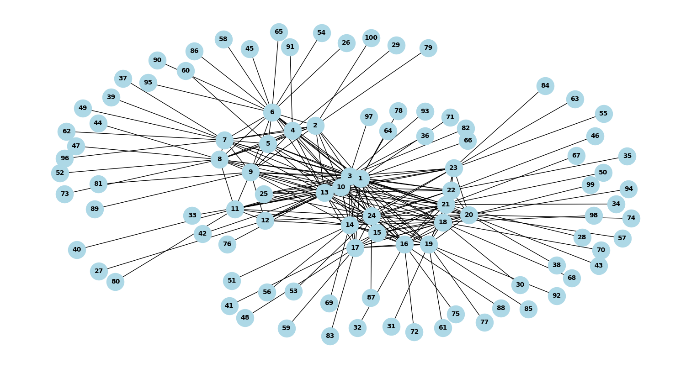

# GhostNet

GhostNet demonstrates a peer-to-peer, private, permissionless, and decentralized communication protocol, drawing inspiration from [Waku](https://waku.org).

> **CAUTION:** This is a basic demonstration of a communication protocol and should not be employed in any production setting. It lacks many essential features, particularly in spam prevention, scalability, and security.



## API Reference

### Get node address

Retrieves the address of a specified node.

```http
GET /address
```

#### Request

```shell
curl --location '/address'
```

#### Response

```text
[NODE ADDRESS]
```

### Ping a node

Sends a ping request to an external node within the network; upon a successful ping, the external node will acknowledge the requesting node as a peer.

```http
POST /ping
```

#### Request

```shell
curl --location '/ping' \
--header 'Content-Type: application/json' \
--data '{
    "node": "[REQUESTING NODE ADDRESS]"
}'
```

#### Response

```text
[PINGED NODE ADDRESS]
```

### Bootstrap a node

Receives a list of external node addresses for establishing connections. Upon successful connections, it acknowledges these nodes as peers, and the external nodes reciprocally recognize the requesting node as a peer.

```http
POST /bootstrap
```

#### Request

```shell
curl --location '/bootstrap' \
--header 'Content-Type: application/json' \
--data '[
    "EXTERNAL NODE ADDRESS 1",
    "EXTERNAL NODE ADDRESS 2",
    "EXTERNAL NODE ADDRESS 3"
]'
```

#### Response

```json
[
    ["SUCCESSFUL NODE CONNECTIONS"],
    ["UNSUCCESSFUL NODE CONNECTIONS"]
]
```

### Get connected nodes

Retrieves the list of connected nodes for a given node.

```http
GET /nodes
```

#### Request

```shell
curl --location '/nodes'
```

#### Response

```json
[
    "CONNECTED NODE ADDRESS 1",
    "CONNECTED NODE ADDRESS 2",
    "CONNECTED NODE ADDRESS 3"
]
```

### Relay a message

Broadcasts a provided message across the entire network, with the capability to accept messages in any arbitrary JSON structure. It returns a list of nodes that acted as relays for the message originating from the source node.

```http
POST /relay
```

#### Request

```shell
curl --location '/relay' \
--header 'Content-Type: application/json' \
--data '{
    "message": "Hello, World!",
    "timestamp": 1234567890
}'
```

#### Response

```json
[
    "RELAYED NODE ADDRESS 1",
    "RELAYED NODE ADDRESS 2",
    "RELAYED NODE ADDRESS 3"
]
```

### Share external nodes

Expands its network of connections by requesting existing nodes to share their list of connected nodes and subsequently establishing connections with them.

```http
GET /node-sharing
```

#### Request

```shell
curl --location '/node-sharing'
```

#### Response

```json
[
    ["SUCCESSFUL NODE CONNECTIONS"],
    ["UNSUCCESSFUL NODE CONNECTIONS"]
]
```
## Run Locally

Clone the project

```shell
git clone https://github.com/LordGhostX/GhostNet
```

Go to the project directory

```shell
cd GhostNet
```

Install dependencies

```shell
pip install -r requirements.txt
```

Run a node instance

```shell
# Run an instance on the default port (6969)
python3 node.py

# Run an instance on a custom port number
python3 node.py [PORT NUMBER]
```

## Running Tests

To run tests, run the following command

```shell
python3 tests.py
```
